# Foundation architecture

How the **vault** and the **graph** fit. Conceptual, not a class dump. Product contract: [`SPEC.md`](./SPEC.md). Tool surface: [`MCP_TOOLS.md`](./MCP_TOOLS.md).

When a change alters the graph or vault shape, update this file in the same PR.

## Glossary

**Foundation** is the product. A **vault** is one instance (`FOUNDATION_DATA` + Postgres). The **graph** is the live network in that vault. The **ontology** is the vocabulary (types and relations). A **blob** is bytes on a node. A **record** is the node. **Activity** is the audit log. An **agent** is anything that can reach the vault MCP. The **user** is the human who runs this vault on this machine. A **bot** is a named role that acts through an agent. Do not call the graph “the Vault.” A git clone is the product, not this vault — starting the host programs elsewhere starts a different instance. Do not use “origin” as a Foundation key; Cursor Origin is source control. Feature brands only: Dream, Vault. Url, repo, and link are ordinary words. Contract: [`SPEC.md`](./SPEC.md#url-repo-and-link).

## Vault

One vault is one running instance. Postgres files and blob files both live under `FOUNDATION_DATA` (the vault data dir). Blobs are `$FOUNDATION_DATA/blobs/<uuid>`. Never put vault files in git.

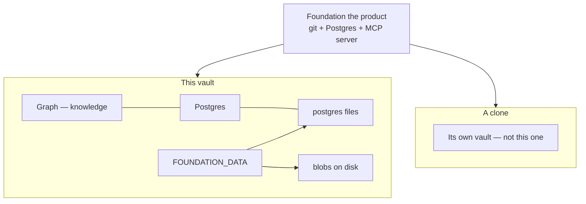

The server listens on this process. MCP attach from a named harness is documented in [`HARNESS.md`](./HARNESS.md). The user window is `/view` on the view publish (`8788`) and is meant to work from another machine on this vault.

## Graph

The graph is the live network in that vault: **nodes**, **typed edges**, and **activity**. Edges are the only source of truth for links. The ontology (types and relations) is the vocabulary in the same vault and can grow; seeds are the day-one words. A type owns `fields`, view declarations (`id` plus optional `filter` / `sort` / `group`) with `default_view`, and identity (`hue`, `glyph`). `json_schema` is compiled from `fields`. The Viewer reads that contract and does not invent a view or a type catalog. Seed apply fills missing seed hue/glyph only; it does not overwrite a user edit.

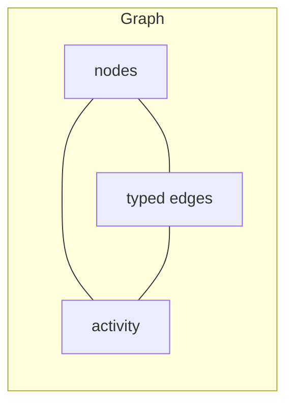

### Node

A record is what is true now, short. History stays in activity. Identity is UUID. `get` returns that record: type, title, status, `payload`, `data`, metadata, timestamps, incident edges. It does not return activity rows.

- **Payload** is the written body: **inline** (`text/markdown`, `text/html`, `application/json`, `text/plain`) or a **blob** (file on the node). A rewrite passes a new `payload` and replaces that body. Omit `payload` and the body stays.
- **data** is structured JSON. It is not the diary. The type’s `fields` compile to `json_schema` (`additionalProperties: true`). upsert validates the merged object against that document. Extra keys still write. `needed` on a field is a hint, not JSON Schema `required`. A `ref` field is a typed UUID, not an edge. Upsert `url { system, id }` is which Gmail, Calendar, or Drive object, not a mirrored body. `url: null` clears uniqueness. `data.repo` is which GitHub object (`{ system, id }`). `repo: null` clears. `data.url` is an optional https address (any type) so the Viewer can open a file that stays the source of truth — not the Drive / Gmail / Calendar url, and not unique. `data.url: null` clears the https address. `data.receipt` is done after a bot sends mail or clears a calendar event (`{ system, id, kind }`; `gmail`/`sent` or `calendar`/`cleared`). `receipt: null` clears. `data.due` is the seed date field (ISO `YYYY-MM-DD`; omit it and the node still writes; `due: null` clears) on `task`, `goal`, and `spend` (on `spend`, display is Date). `project` may hold optional `budget_amount` / `budget_currency`. `spend` holds `amount`, `currency`, `due`, `vendor` (string), and `stage` (`quoted` | `paid`). `data.aliases` is an optional string array of user-authored alternate names (any type; used by `lookup`). Stored on the JSONB `data` object, not a separate column. Seed apply fills missing seed fields and missing seed hue/glyph only; it does not overwrite a user edit.

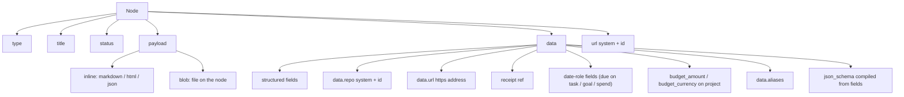

### Spine and artifacts

Hierarchy verb is `child_of`. At most one `child_of` per node. Allowed parents come from the child’s type (`parent_types`).

Spine: **area → project → goal → habit | task** — preferred placement, not a hard gate. `habit` prefers a goal parent and does not need one. `task` may `child_of` `goal` or `project` (prefer goal when there is a real outcome). `task` cannot `child_of` `area`.

Recommended structure: Area → project → goal → task. Prefer a habit under a goal; a habit does not need a goal parent. A task may child_of a goal or a project. Prefer a spend under a project; a spend does not need a project parent. Prefer a lesson or decision under an area, project, or goal; they do not need that parent.

Artifacts hang off that spine or sit beside it. Seeds include person, place, company, decision, note, lesson, journal, idea, trip, spend. `lesson` and `decision` may hang under area, project, or goal and do not need that parent. Prefer a `spend` under a project (`child_of`); a spend does not need a project parent. If you hang it, it must be a project. `person`, `place`, `company`, `note`, and the other artifacts sit beside unless an agent links them. `spend` is one money line, not a ledger.

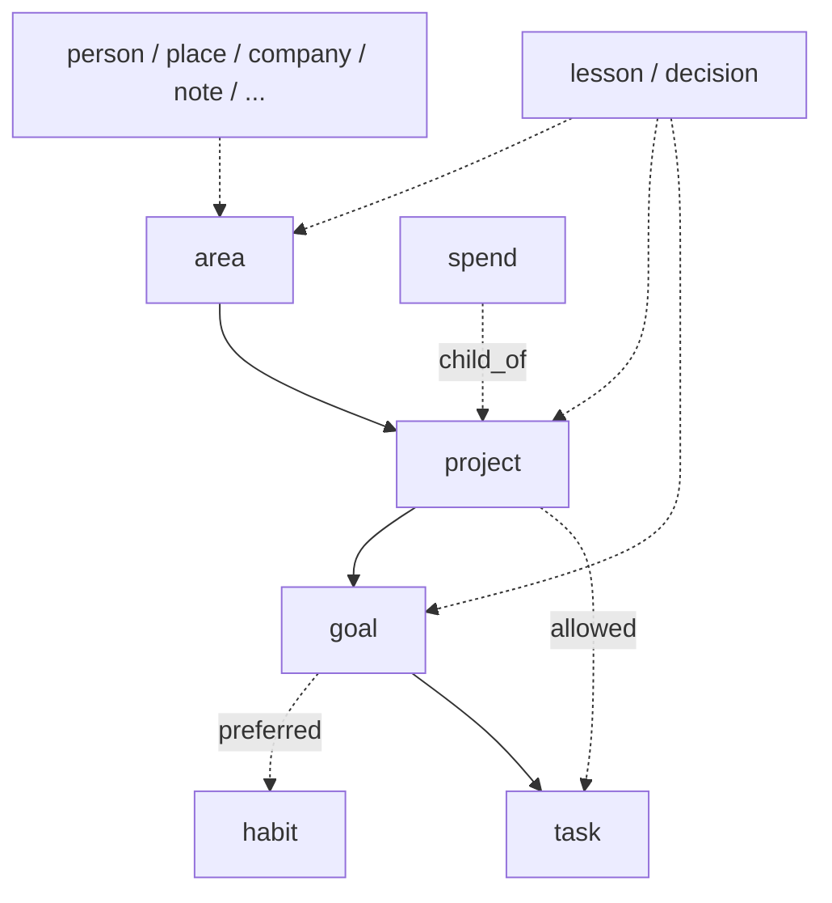

Stored edge is `child_of` (child → parent). The picture above is the spine, not the arrow direction in Postgres.

### Edges

**Hierarchy** is `child_of` (one parent). **Associative** edges are everything else: `relates_to` (any type, symmetric), `about` (target is a person), `supports`, `inspired_by`, `references`. Agents may add relation types.

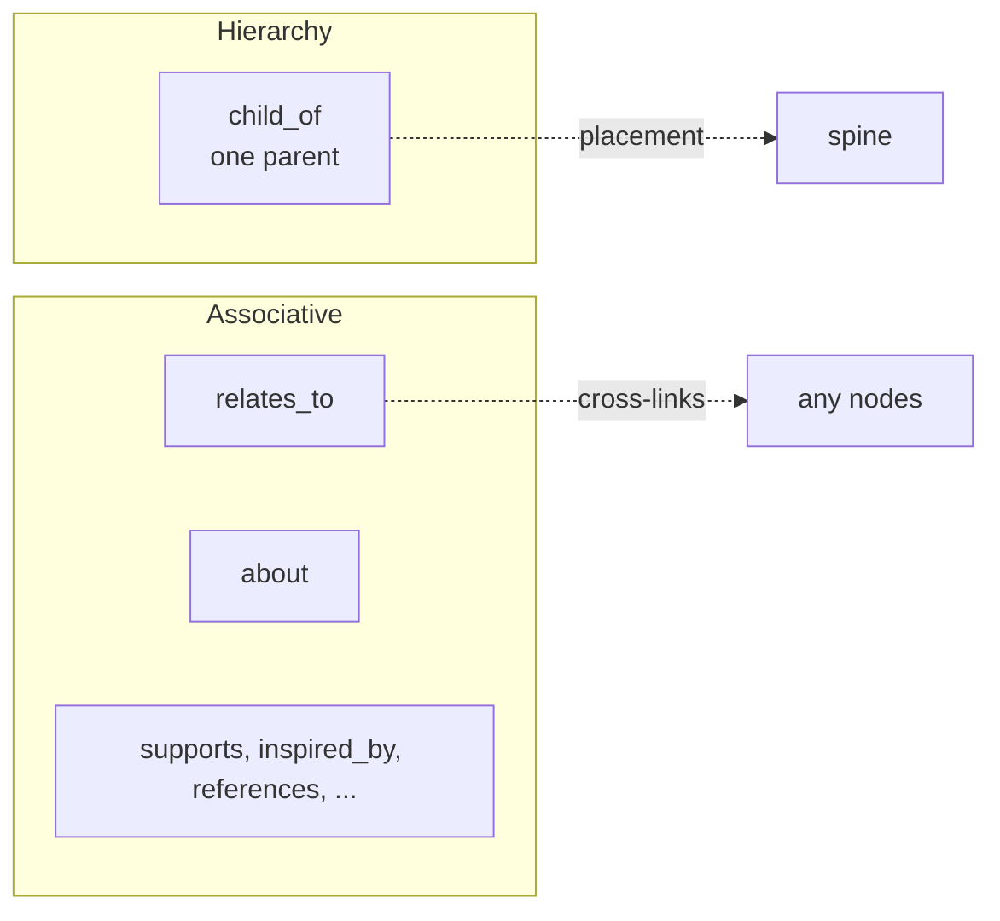

## Blob

A blob is a file on a node, stored at `$FOUNDATION_DATA/blobs/<uuid>`. `get` returns metadata (`blob_id`, sha256, media type, size), not bytes. Bytes are `GET /blobs/:id` with the API key. Ingest is on `upsert` (`bytes_base64` or a file under `$FOUNDATION_DATA/uploads`). Soft-delete does not delete bytes, so undo can restore a blob node.

## Writes

Writes go through the graph and leave **activity**. `undo` reverses a reversible row. This is lost-update protection and a receipt, not an ACL.

- **Rewrite one record:** a named bot rewrites one record on purpose: `get` → `list_activity` `{ target }` → keep what still matters, invent nothing → `upsert` the same id with a short `payload` and `base_updated_at`. One record at a time. Not a background job. The server does not invent the body. A bad body is rebuilt from the `before` / `after` snapshots already on activity. No new tool. Contract: [`SPEC.md`](./SPEC.md#rewrite-one-record).
- **Compare-and-swap:** update and `link` are if-match. Pass `base_updated_at` (or endpoint timestamps) from `get`. Compared at millisecond precision so a never-updated node (including rows that still store leftover microseconds from `now()`) can be written when the caller passes `updated_at` from `get`. If the node moved, the vault refuses with stale (get and retry) — a CAS miss is never “node not found.”
- **Batch link:** `link` accepts one edge or `edges[]` (1–20). The whole batch validates, then one graph transaction writes every edge or none. First error wins. One activity receipt per written edge (`links[]` in input order). Each edge carries both endpoint timestamps; a later edge does not inherit CAS from an earlier edge that named the same node. Several edges that share a node still use one agreed `updated_at`. Linking does not bump `node.updated_at`. `undo` inverts one receipt. This is a graph write (live nodes and edges), not an ontology change.
- **payload replace:** update replaces `payload` when that field is passed. Omit it and the body stays.
- **data merge:** update patches `data` (`JSONB ||`). A partial patch does not wipe other keys.
- **Create idempotency:** `idempotency_key` on create. A retry returns the same node; it does not twin.
- Optional `actor` / `actor_label` are stored on the activity row (who wrote), not a permission gate.
- **Suggested links:** `upsert` (and `get` when the node still has no edges) may return `suggested_links` from title FTS. These are proposals (`child_of` / `about` / `relates_to` to a live target). A node that already has a live `child_of` is not offered a second parent. The vault does not invent types or write an edge; `link` is the write.

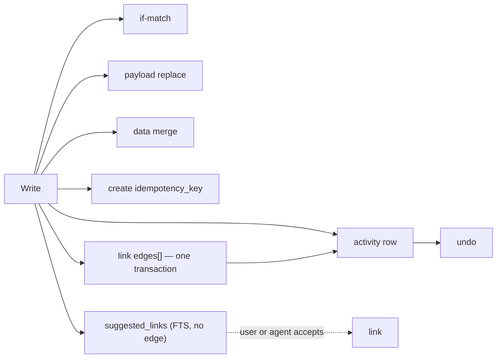

`list_activity` `{ target: <node id> }` is the diary for that node. Newest first. Default limit 50, max 200. Page older rows with `since`. `get` does not include these rows.

## Search

`search` is Postgres full-text on title, `data` strings, and extracted inline payload text. Latin accents are folded. Not embeddings.

`query` is optional when a filter is set, so agents can list without a word:

- `type` / `status`
- `under` — live `child_of` children of a parent UUID
- `since` — updated after an ISO timestamp
- `url` — unique live Drive / Gmail / Calendar `{ system, id }`
- `repo` — unique live `data.repo` (GitHub)
- `receipt` — unique live `data.receipt` ref (sent mail or cleared event)
- `due` — `overdue` or `today` (`America/New_York`)
- `due_on_or_before` / `due_on_or_after` — inclusive ISO date window on `data.due`
- `data_equals` — one or a few top-level `data` keys equal a string value (JSONB `@>`, same family as `data.url` / `data.due`; not a column per key). Example shape: `{ kind: "…", status: "…" }`. Seed `spend` filters `{ stage: "quoted" }` or `{ currency: "USD" }` this way; `amount` is a number and does not.

Empty `{}` is an error (no `list_nodes` tool). Hits are lean and include `due` when `data.due` is set; `get` loads the record, `data.due`, and neighbor titles.

`lookup` is a separate read-only tool: batch name resolution with a result per input. Unique folded title, unique user alias, or UUID may bind. Token and fuzzy matches are candidates that need user confirmation before a write. Each useful candidate includes `id`, `type`, canonical `title`, `updated_at`, `match`, and `confidence` plus the surrounding `candidates` list. `confidence` ranks; it is not a probability and does not authorize a write. Title folding uses generated `title_norm` / `title_compact` and trigram indexes. Aliases stay on `data.aliases` (JSONB unnest). Create-time `upsert` (no `id`) uses the same matcher: exact/alias hits refuse unless `allow_duplicate` is set; fuzzy hits warn. Not embeddings.

`working_set` is a separate read-only tool over the same nodes and edges. Given one live id, it returns the actionable set around that root: open work, dues, and the parent chain when the type has `parent_types`. Walks use the live ontology (hierarchy kind and `parent_types`, associative about-targets, `start`/`end` date roles). The graph shape is unchanged. Caps and a due window keep a spine-root (`area`) from dumping a life. After `lookup` binds a name, this is the one agenda call. It is not the rewrite loop — `get` is the record, `list_activity` `{ target }` is the diary. Age-decay on this agenda is out of this amendment. Parameters: [`MCP_TOOLS.md`](./MCP_TOOLS.md).

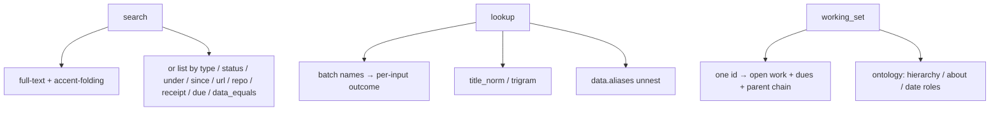

## Url, repo, and link

Gmail, Calendar, and Drive stay the source of truth. The graph holds upsert `url { system, id }` and optional `data.url` as the https address the Viewer opens. Live records are unique on that pair. Look up with `search { url }`, then `get`. There is no `kind` on that url. Link is the edge tool. Open leaves the window for that file.

GitHub stays the source of truth. The graph holds `data.repo { system, id }`. Live records are unique on that pair. Look up with `search { repo }`, then `get`. GitHub is not a Drive/Sheet. Cursor Origin is not a vault key and not a `repo.system` value.

Do not fetch or mirror those systems’ bodies into the graph.

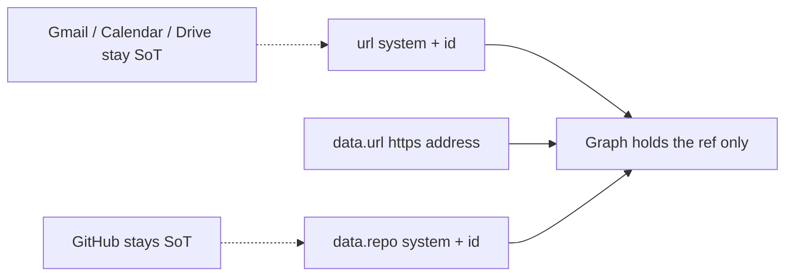

## Receipt

When a bot sends mail or clears a calendar event, the record holds `data.receipt { system, id, kind }`. Store the ref only. `system` is `gmail` | `calendar`. `kind` is `sent` | `cleared`. Pairing is closed. Live records are unique on `system`+`id`, independent of url. Look up with `search { receipt }`, then `get`. The server does not invent the receipt. Gmail and Calendar stay the source of truth — no bodies in the vault.

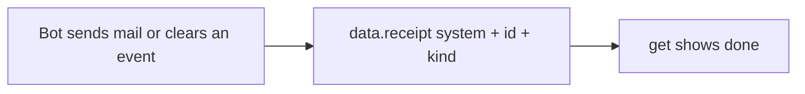

## How agents reach the vault

Agents talk to the vault over MCP. That path is not the architecture — it is the door.

`/mcp` with `Authorization: ApiKey <FOUNDATION_API_KEY>`. Streamable HTTP on this process. Named harnesses attach with that URL and key: [`HARNESS.md`](./HARNESS.md).

Fourteen tools: `bootstrap`, `search`, `lookup`, `get`, `working_set`, `upsert`, `delete`, `link`, `unlink`, `inspect_ontology`, `manage_type`, `manage_relation`, `list_activity`, `undo`. `get` is the record. `list_activity` `{ target }` is the diary. `upsert` replaces `payload` when passed.

An agent that can reach the vault MCP may read/write; one that cannot does not.

## How the user looks at the vault

The user opens a window on the view publish: `/view` (`http://127.0.0.1:8788/view`; from another machine, `http://<this-host>:8788/view`). Same API key as MCP. Same graph — not a second store. Vite + React on this process. One chrome, a content host, three surfaces: Home (Recents, open tasks, type folders for types that have live objects), Collection (the type’s declared views, including graph), Detail (a page — not a docked inspector). A journal opens a writing page; title and markdown body may write (if-match, actor user). Search is a rail overlay. The rail is Home and Search. Types carry hue and glyph; Viewer reads them, with a quiet fallback when missing. Off-box unlock and session use the same key and `Path=/view` cookie. The cookie does not unlock `/mcp`. Blob bytes from the window are `GET /view/blobs/:id` (unlock cookie or Authorization header). Agents still fetch `GET /blobs/:id` with the header. Contract: [`VIEWER.md`](./VIEWER.md).

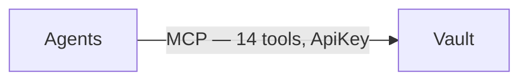

Two agents may write the same node through that one MCP. Update and `link` are if-match. If the node moved, the vault **refuses**. The caller’s next move is get and retry.

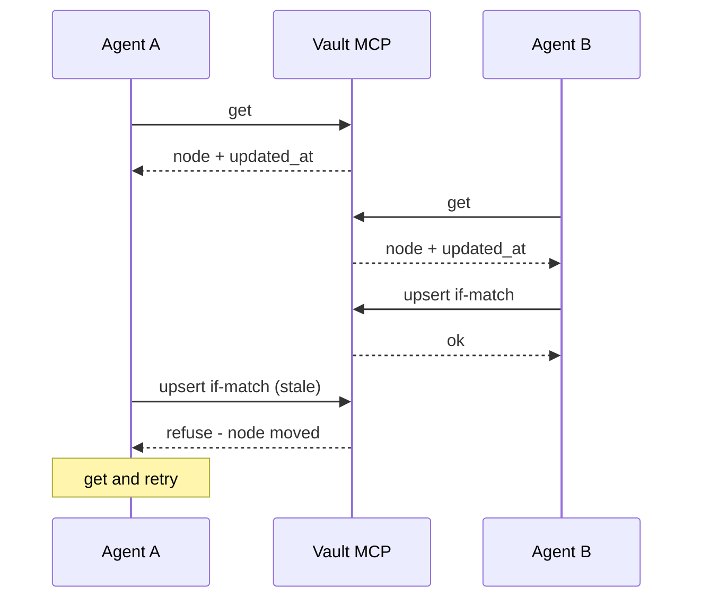
