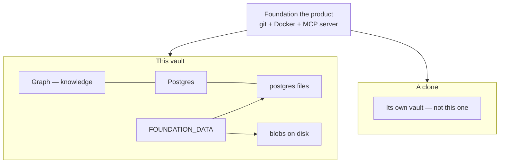
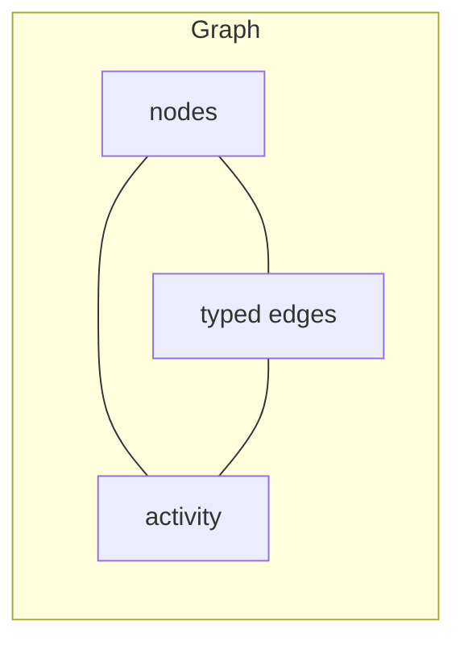
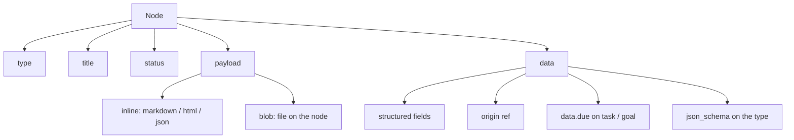
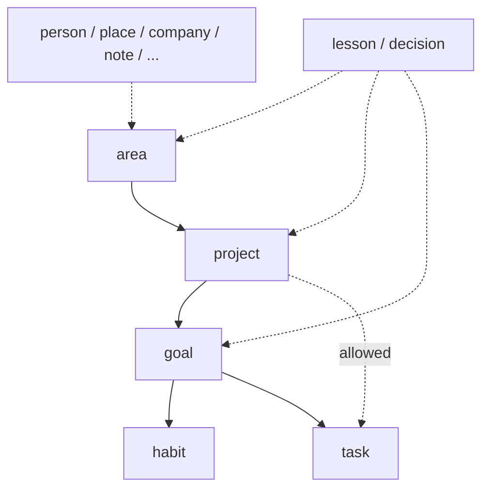
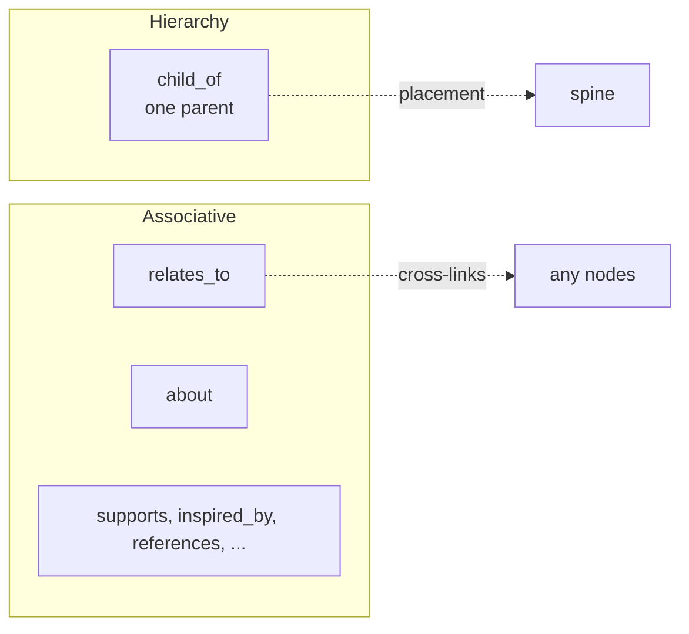
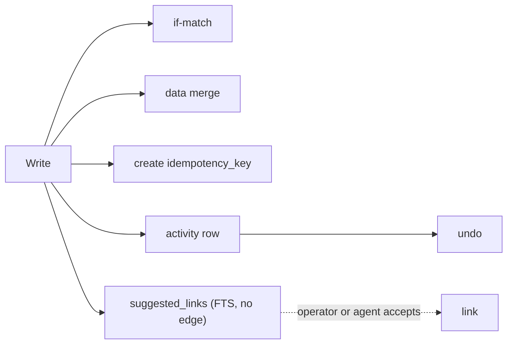
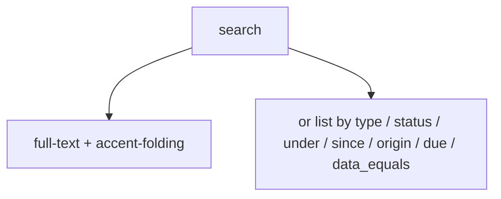
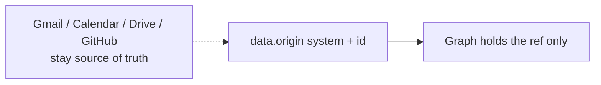
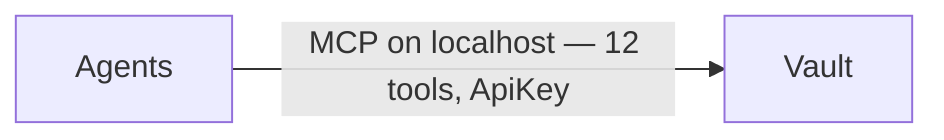
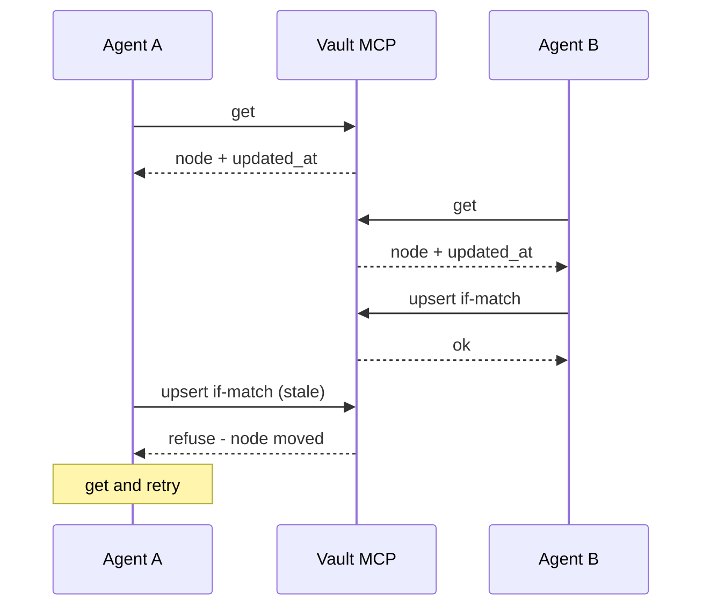

# Foundation architecture

Living picture of the **vault** and the **graph**. Conceptual, not a class dump. Product contract: [`SPEC.md`](./SPEC.md). Tool surface: [`MCP_TOOLS.md`](./MCP_TOOLS.md).

When a change alters the graph or vault shape, update this file in the same PR.

## Glossary

**Foundation** is the product. A **vault** is one instance (`FOUNDATION_DATA` + Postgres). The **graph** is the knowledge in that vault. A **blob** is a file on a node. An **agent** is anything that can reach the vault MCP. The **operator** is the human who runs Compose. Do not call the graph “the Vault.” A git clone is the product, not this vault — `compose up` elsewhere starts a different instance.

## Vault

One vault is one running instance. Postgres files and blob files both live under `FOUNDATION_DATA` (the vault data dir). Blobs are `$FOUNDATION_DATA/blobs/<uuid>`. Never put vault files in git.

Compose publishes the server at `127.0.0.1:8787` only. Do not bind 8787 beyond localhost.

## Graph

The graph is the knowledge in that vault: **nodes**, **typed edges**, and **activity**. Edges are the only source of truth for links. Ontology (types and relations) is data in the same vault and can grow; seeds are the day-one vocabulary.

### Node

A node has **type**, **title**, **status**, a **payload**, and **data**. Identity is UUID.

- **Payload** is either **inline** (`text/markdown`, `text/html`, `application/json`, `text/plain`) or a **blob** (file on the node).
- **data** is structured JSON. If the type has `json_schema`, upsert validates the merged object. `data.origin` is an optional pointer, not a mirrored body. `data.due` is an optional ISO date (`YYYY-MM-DD`) on `task` and `goal` (enforced when present; omit it and the node still writes; `due: null` clears). Stored on the JSONB `data` object, not a separate column.

### Spine and artifacts

Hierarchy verb is `child_of`. At most one `child_of` per node. Allowed parents come from the child’s type (`parent_types`).

Spine: **area → project → goal → habit | task** — preferred placement, not a hard gate. `task` may `child_of` `goal` or `project` (prefer goal when there is a real outcome). `task` cannot `child_of` `area`.

Recommended structure: Area → project → goal → task. A habit hangs under a goal. A task may child_of a goal or a project.

Artifacts hang off that spine or sit beside it. Seeds include person, place, company, decision, note, lesson, journal, idea, trip. `lesson` and `decision` may hang under area, project, or goal. `person`, `place`, `company`, `note`, and the other artifacts sit beside unless an agent links them.

Stored edge is `child_of` (child → parent). The picture above is the spine, not the arrow direction in Postgres.

### Edges

**Hierarchy** is `child_of` (one parent). **Associative** edges are everything else: `relates_to` (any type, symmetric), `about` (target is a person), `supports`, `inspired_by`, `references`. Agents may add relation types.

## Blob

A blob is a file on a node, stored at `$FOUNDATION_DATA/blobs/<uuid>`. `get` returns metadata (`blob_id`, sha256, media type, size), not bytes. Bytes are `GET /blobs/:id` with the API key. Ingest is on `upsert` (`bytes_base64` or a file under `$FOUNDATION_DATA/uploads`). Soft-delete does not delete bytes, so undo can restore a blob node.

## Writes

Writes go through the graph and leave **activity**. `undo` reverses a reversible row. This is lost-update protection and a receipt, not an ACL.

- **Compare-and-swap:** update and `link` are if-match. Pass `base_updated_at` (or endpoint timestamps) from `get`. Compared at millisecond precision so a never-updated node (including rows that still store leftover microseconds from `now()`) can be written when the caller passes `updated_at` from `get`. If the node moved, the vault refuses with stale (get and retry) — a CAS miss is never “node not found.”
- **data merge:** update patches `data` (`JSONB ||`). A partial patch does not wipe other keys.
- **Create idempotency:** `idempotency_key` on create. A retry returns the same node; it does not twin.
- Optional `actor` / `actor_label` are stored on the activity row (who wrote), not a permission gate.
- **Suggested links:** `upsert` (and `get` when the node still has no edges) may return `suggested_links` from title FTS. These are proposals (`child_of` / `about` / `relates_to` to a live target). A node that already has a live `child_of` is not offered a second parent. The vault does not invent types or write an edge; `link` is the write.

## Search

`search` is Postgres full-text on title, `data` strings, and extracted inline payload text. Latin accents are folded. Not embeddings.

`query` is optional when a filter is set, so agents can list without a word:

- `type` / `status`
- `under` — live `child_of` children of a parent UUID
- `since` — updated after an ISO timestamp
- `origin` — unique live `data.origin` ref
- `due` — `overdue` or `today` (`America/New_York`)
- `due_on_or_before` / `due_on_or_after` — inclusive ISO date window on `data.due`
- `data_equals` — one or a few top-level `data` keys equal a string value (JSONB `@>`, same family as `data.origin` / `data.due`; not a column per key). Example shape: `{ kind: "…", status: "…" }`.

Empty `{}` is an error (no `list_nodes` tool). Hits are lean and include `due` when `data.due` is set; `get` loads payload, `data.due`, and neighbor titles.

## Origin

Gmail, Calendar, Drive, and GitHub stay the source of truth. The graph may hold `data.origin { system, id }` only. Live nodes are unique on that pair. Look up with `search { origin }`, then `get`. Do not fetch or mirror those systems’ bodies into the graph.

## How agents reach the vault

Agents talk to the vault over MCP. That path is not the architecture — it is the door.

`http://127.0.0.1:8787/mcp` with `Authorization: ApiKey <FOUNDATION_API_KEY>`. Streamable HTTP on this process. Port stays localhost.

Twelve tools: `bootstrap`, `search`, `get`, `upsert`, `delete`, `link`, `unlink`, `inspect_ontology`, `manage_type`, `manage_relation`, `list_activity`, `undo`.

An agent that can reach the vault MCP may read/write; one that cannot does not.

## How the operator looks at the vault

The operator opens a read-only HTTP window on the same localhost process: `http://127.0.0.1:8787/view`. Same API key as MCP. HTML pages on this server — not a second app and not a second graph. Search and open nodes; the window does not write. Blob bytes from a node page are `GET /view/blobs/:id` (unlock cookie or Authorization header). Agents still fetch `GET /blobs/:id` with the header.

Two agents may write the same node through that one MCP. Update and `link` are if-match. If the node moved, the vault **refuses**. The caller’s next move is get and retry.

