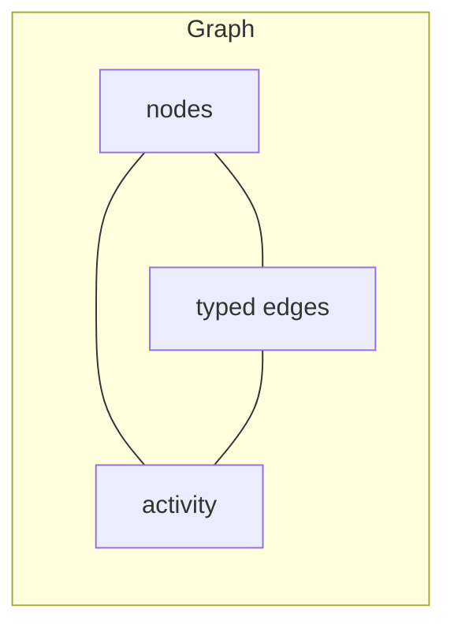
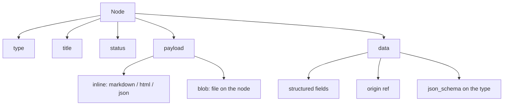
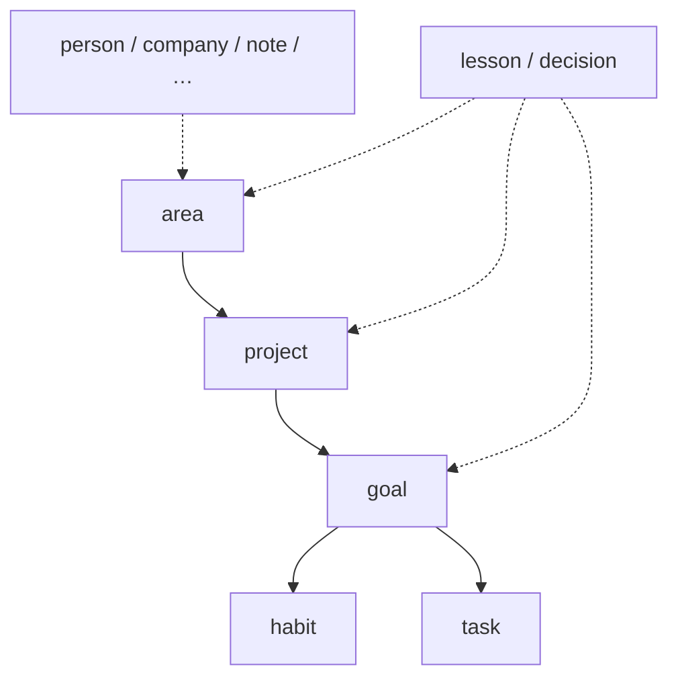
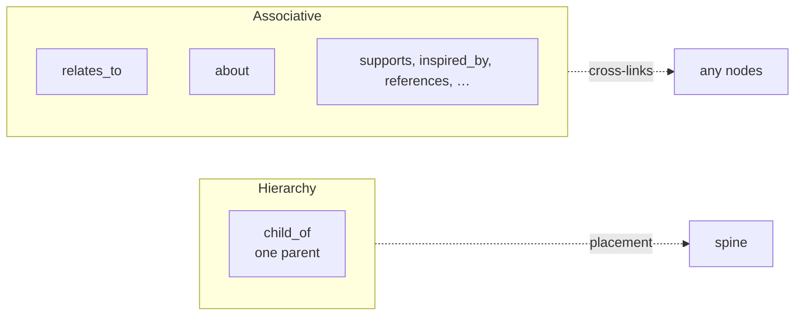
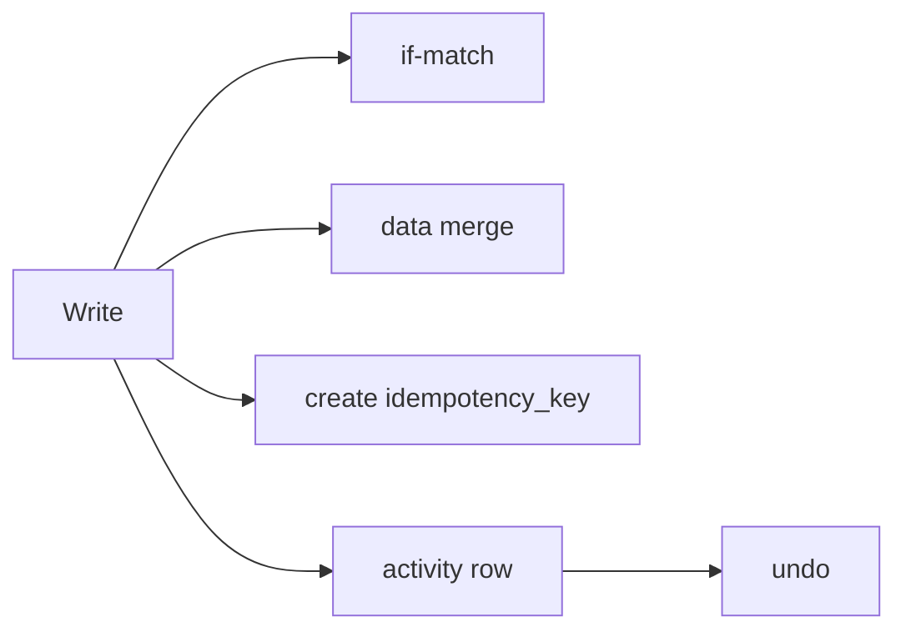
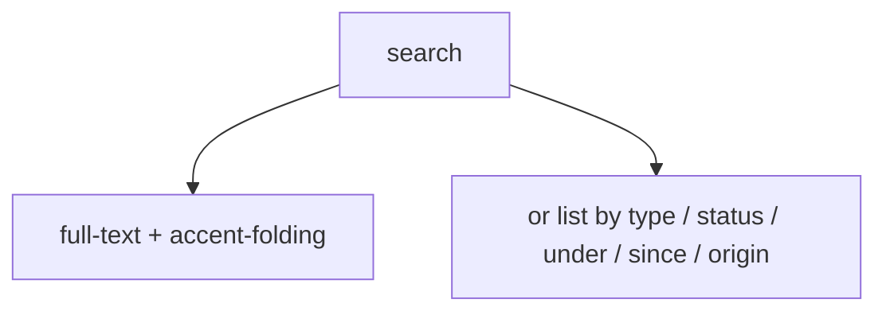
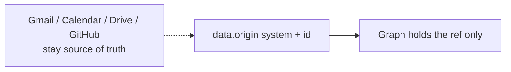
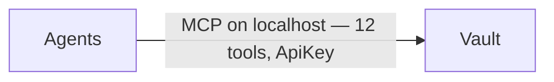

# Foundation architecture

Living picture of the **vault** and the **graph** as shipped on `main` through [PR #12](https://github.com/dgraziosi/foundation/pull/12). Conceptual, not a class dump. Product contract: [`SPEC.md`](./SPEC.md). Tool surface: [`MCP_TOOLS.md`](./MCP_TOOLS.md).

## Glossary

**Foundation** is the product (this repo, Docker, the MCP server). A **vault** is one running instance: one `FOUNDATION_DATA` and one Postgres. The **graph** is the knowledge in that vault. A **blob** is a file on a node. Do not call the graph “the Vault.” A git clone is the product, not this vault — `compose up` elsewhere starts a different instance.

## Standing order

When a slice changes the graph or vault shape (tools, storage, or what Foundation may hold vs leave in an origin system), update this file in the **same PR**. Merge bar includes **“ARCHITECTURE.md still true.”**

## Vault

One vault is one running instance. Postgres files and blob files both live under `FOUNDATION_DATA`. Blobs are `$FOUNDATION_DATA/blobs/<uuid>`. Never point `FOUNDATION_DATA` at an agent profile or memory directory. Never put vault files in git.

```mermaid
flowchart TB
  product["Foundation the product<br/>git + Docker + MCP server"]
  product --> thisVault
  product --> otherVault

  subgraph thisVault["This vault"]
    graph["Graph — knowledge"]
    pg["Postgres"]
    data["FOUNDATION_DATA"]
    data --> pgfiles["postgres files"]
    data --> blobs["blobs on disk"]
    graph --- pg
    pg --- pgfiles
  end

  subgraph otherVault["A clone"]
    empty["Its own vault — not this one"]
  end
```

Compose publishes the server at `127.0.0.1:8787` only. Do not bind 8787 beyond localhost.

## Graph

The graph is the knowledge in that vault: **nodes**, **typed edges**, and **activity**. Edges are the only source of truth for links. Ontology (types and relations) is data in the same vault and can grow; seeds are the day-one vocabulary.



### Node

A node has **type**, **title**, **status**, a **payload**, and **data**. Identity is UUID.

- **Payload** is either **inline** (`text/markdown`, `text/html`, `application/json`, `text/plain`) or a **blob** (file on the node).
- **data** is structured JSON. If the type has `json_schema`, upsert validates the merged object. `data.origin` is an optional pointer, not a mirrored body.



### Spine and artifacts

Hierarchy verb is `child_of`. At most one `child_of` per node. Allowed parents come from the child’s type (`parent_types`).

Spine: **area → project → goal → habit | task**.

Artifacts hang off that spine or sit beside it. Seeds include person, company, decision, note, lesson, journal, idea, trip. `lesson` and `decision` may hang under area, project, or goal. `person`, `company`, `note`, and the other artifacts sit beside unless an agent links them.



Stored edge is `child_of` (child → parent). The picture above is the spine, not the arrow direction in Postgres.

### Edges

**Hierarchy** is `child_of` (one parent). **Associative** edges are everything else: `relates_to` (any type, symmetric), `about` (target is a person), `supports`, `inspired_by`, `references`. Agents may add relation types.



## Blob

A blob is a file on a node, stored at `$FOUNDATION_DATA/blobs/<uuid>`. `get` returns metadata (`blob_id`, sha256, media type, size), not bytes. Bytes are `GET /blobs/:id` with the API key. Ingest is on `upsert` (`bytes_base64` or a file under `$FOUNDATION_DATA/uploads`). Soft-delete does not delete bytes, so undo can restore a blob node.

## Writes

Writes go through the graph and leave **activity**. `undo` reverses a reversible row. This is lost-update protection and a receipt, not an ACL.

- **Compare-and-swap:** update and `link` are if-match. Pass `base_updated_at` (or endpoint timestamps) from `get`. Mismatch → get and retry.
- **data merge:** update patches `data` (`JSONB ||`). A partial patch does not wipe other keys.
- **Create idempotency:** `idempotency_key` on create. A retry returns the same node; it does not twin.
- Optional `actor` / `actor_label` are stored on the activity row (who wrote), not a permission gate.



## Search

`search` is Postgres full-text on title, `data` strings, and extracted inline payload text. Latin accents are folded. Not embeddings.

`query` is optional when a filter is set, so agents can list without a word:

- `type` / `status`
- `under` — live `child_of` children of a parent UUID
- `since` — updated after an ISO timestamp
- `origin` — unique live `data.origin` ref

Empty `{}` is an error (no `list_nodes` tool). Hits are lean; `get` loads payload and neighbor titles.



## Origin

Gmail, Calendar, Drive, and GitHub stay the source of truth. The graph may hold `data.origin { system, id }` only. Live nodes are unique on that pair. Look up with `search { origin }`, then `get`. Do not fetch or mirror those systems’ bodies into the graph.



## How agents reach the vault

Agents talk to the vault over MCP. That path is not the architecture — it is the door.

`http://127.0.0.1:8787/mcp` with `Authorization: ApiKey <FOUNDATION_API_KEY>`. Streamable HTTP on this process, not a Cursor catalog connector. Port stays localhost.

Twelve tools: `bootstrap`, `search`, `get`, `upsert`, `delete`, `link`, `unlink`, `inspect_ontology`, `manage_type`, `manage_relation`, `list_activity`, `undo`. No thirteenth tool.


